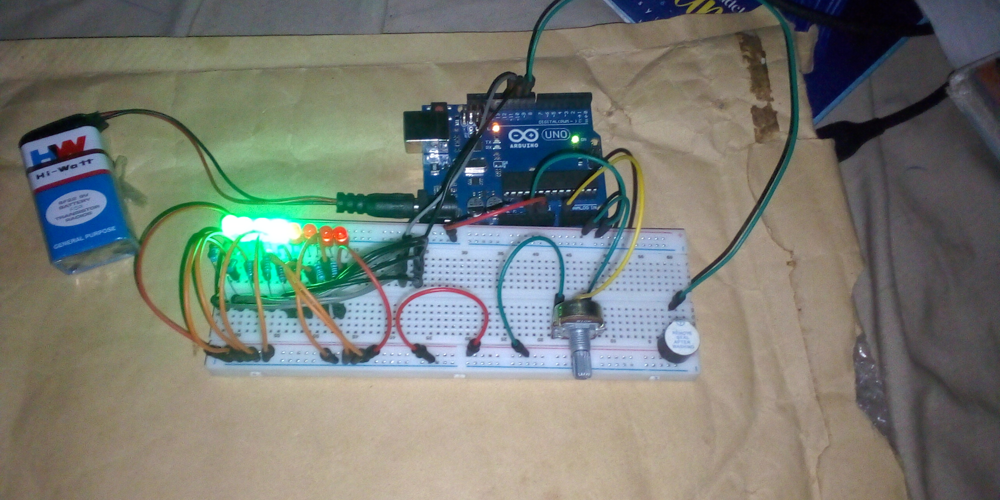

# Car Reversing Sensor Alarm – Arduino Project

## Overview
This project simulates a car reversing sensor alarm using Arduino. A potentiometer represents the distance between a car and an obstacle. As the distance decreases, the buzzer sound frequency increases, and indicator LEDs blink alternately to warn the driver.

## Objective
- Learn how to read analog sensor values using Arduino
- Simulate distance measurement using a potentiometer
- Generate sound tones with varying pitch using a buzzer
- Use LEDs as visual warning indicators
- Understand how sensor values can control system behavior

## Components Used
- Arduino Uno
- Buzzer
- LEDs × 2
- Potentiometer
- 220Ω resistors
- Breadboard
- Jumper wires
- 9V Battery
- 9V Battery Clip to DC Barrel Jack

## Circuit Diagram

For other project images [Click Here](images/)

## How It Works
1. A potentiometer connected to an analog pin simulates the distance between the car and an obstacle.
2. The Arduino reads the potentiometer value using `analogRead()`.
3. The sensor value is mapped to a sound frequency range using the `map()` function.
4. The buzzer produces a tone whose pitch increases as the simulated distance decreases.
5. Two LEDs blink alternately to provide a visual warning signal.
6. Delays are used to control the blinking rate and buzzer timing.

## Code
The Arduino sketch for this project is located in the [code/ directory](code/car_reversing_sound_project_on_23rd_october_2025.ino
).

## Demo Video
A demonstration video showing the working project is included in this repository.

📹 **Project Demonstration:**  
[Click here to watch/download the demo video](video/car_revearsing_video.mp4)

*(If the video does not preview directly on GitHub, please download it using the link above.)*

## Reflection (What I Learned)
- How to read analog inputs from sensors
- Mapping sensor values to real-world outputs
- Using a buzzer to generate warning sounds
- Combining audio and visual feedback in embedded systems

## Challenges Faced
- Choosing an appropriate pitch range for the buzzer
- Synchronizing LED blinking with buzzer timing
- Fine-tuning delay values for realistic alarm behavior

## Possible Improvements
- Replace the potentiometer with an ultrasonic distance sensor
- Increase alarm speed as distance reduces
- Add an LCD to display distance readings

## Project Status
Completed
